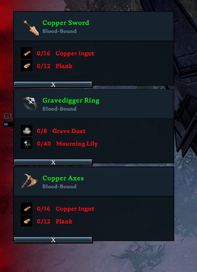

# Track Crafts (V Rising - Client Plugin)

### Description

Middle Click on a recipe to track it. Press F1 to clear all. Press F2 to show/hide all.
Note: Currently not auto updating

### Features
⚙️ Hot reloading with [Bloodstone API](https://github.com/decaprime/Bloodstone/releases)

### Installation
- Install [BepInExPack V Rising](https://github.com/decaprime/VRising-Modding/releases/tag/1.668.2)
- Install [Bloodstone API](https://github.com/decaprime/Bloodstone/releases)
- Extract ``TrackCrafts.dll`` folder into _(VRising folder)/BepInEx/plugins_ or _(VRising folder)/BepInEx/BloodstonePlugins_

### Limitations
This is my first plugin, as well as my first time touching any game engine. If you know how to, I would love someone to teach me or create a PR for
- Auto update cost details as you add items to your inventory

### Changelog

`0.0.6`
- Gloomrot Update
- Requires Bloodstone (Wetstone successor)
- Can now configure the scale of the tracked items (default is 0.75)
- Can now configure how many can be tracked at once (default is 3)

`0.0.5` Forgot to add readme to release

`0.0.4` You can now track many recipes and delete them individually
- Size of the recipes is now smaller
- Added a button to delete recipes individually
- You can now set a keybind to show/hide the pinned recipes

`0.0.3` Fix bug where middle clicking on non recipes would pin recipe

`0.0.2` Update Readme

`0.0.1` First release

### Credits
- arwen - README
- Elmegaard - build script
- p1xel8ted - Updating for Gloomroot
